Vectrex Stereo AY
===

A simple PCB to turn your Vectrex AY-3-8912 3 channel mono sound into stereo line out!

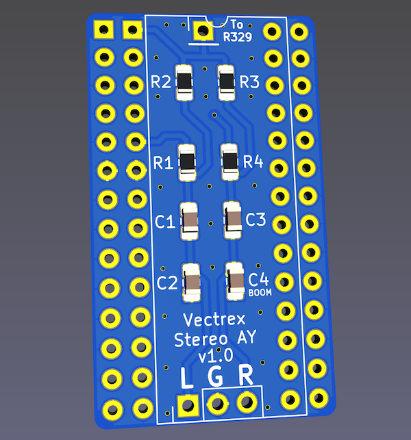
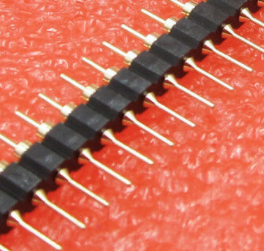
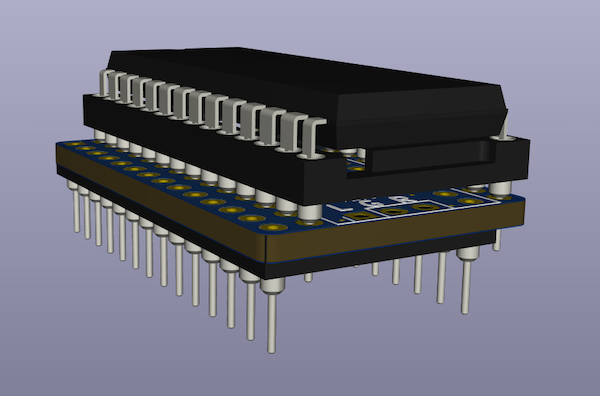

How does it sound?
===

[Check out my Youtube demo](https://www.youtube.com/watch?v=SDDFqmjVvJo&ab_channel=BDub)

How to Use
===

- Refer to Installation Pics below
- Remove your AY-3-8912 from its socket
- Plug the AY-3-8912 into this adapter
- Plug this adapter into the AY's socket
- Clip the micro grabber on 
    - 2GE: Clip onto the bottom of R329 as pictured below.
    - 3GE: Clip on the same place or R329, which is just a jumper wire.
- Plug into your favorite amplifier and enjoy!

BOM and Parts ordering
===

- 1x - 1 x 14 male machine pin header [10PCS 40 Pin 2.54mm Single Row Round Male Pin Header machined J8](https://www.ebay.com/itm/373634328180)
- 1x - 28-pin DIP wide machined pin socket [10Pcs 2.54mm Pitch 28 Pin DIP Round Pin Solder IC Socket Adaptor Wide](https://www.ebay.com/itm/182182186937)
- 2x - 15k 1% 0805
- 2x - 10k 1% 0805
- 2x - 0.22uF 0805
- 2x - 2.2nF 0805
- 1x - Micro grabber [-> get something like this one <-](https://www.amazon.com/Minigrabber-Clip-Test-Wires-colors/dp/B01H5UMZXM) ... [X avoid this style X](https://www.amazon.com/DIYhz-Colors-Grabbers-Electronic-Experiment/dp/B07BCZSNGS)
- 1x - [3.5mm Female Stereo audio pigtail](https://www.amazon.com/gp/product/B082VVWND3)

Installation Pics
===

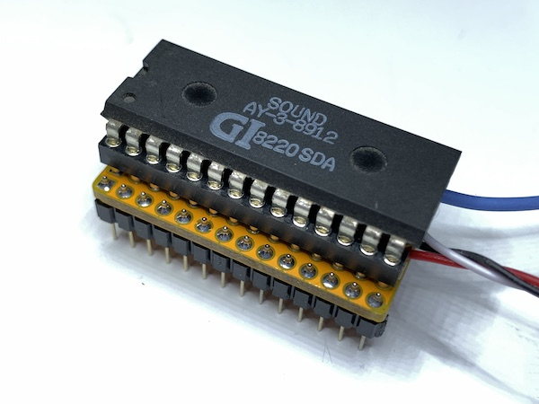
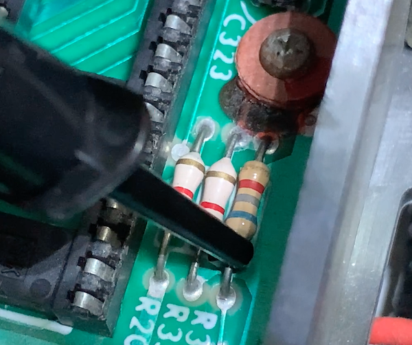
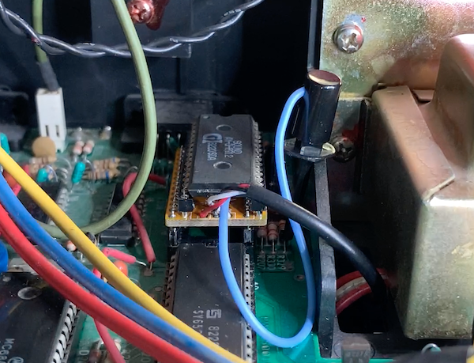
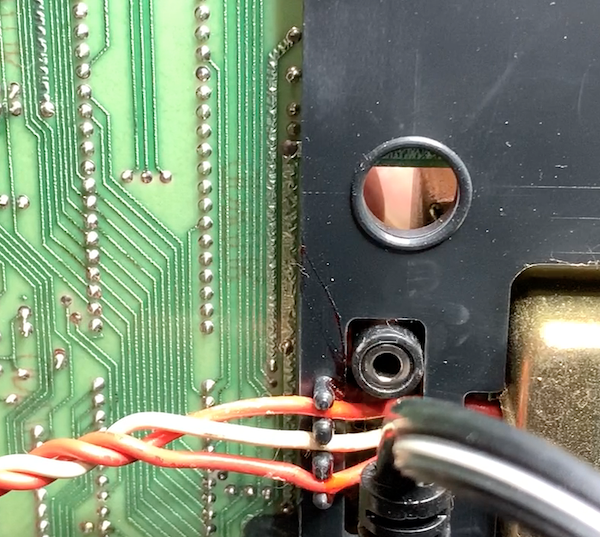
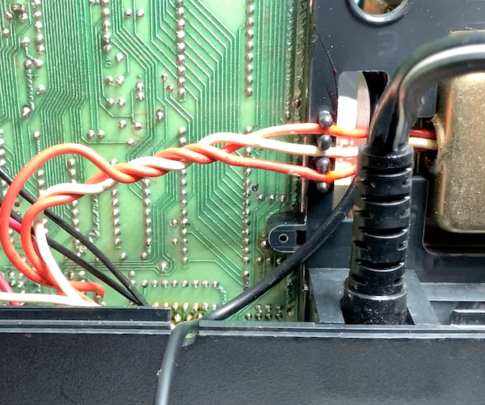
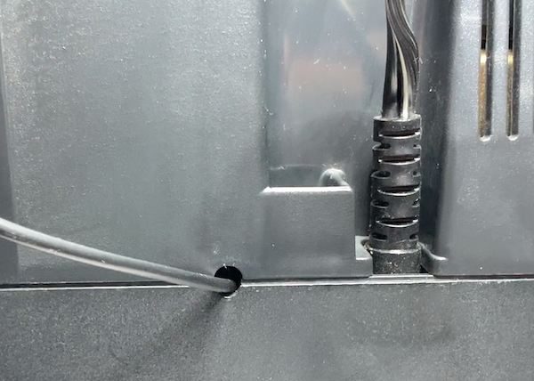
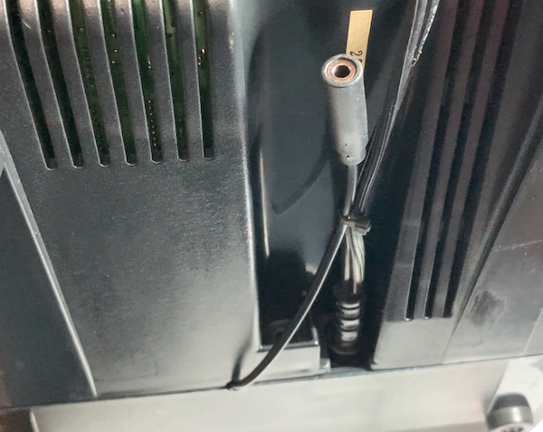
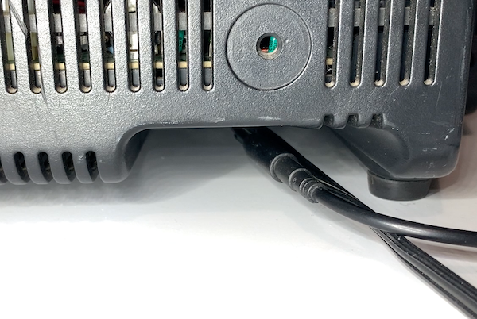

Ordering PCB's
===

OSHPark is a good place to order with purple or the new "after dark" theme color scheme.  You can upload the KiCad `vextrex-eprom-dumper.kicad_pcb` there directly.  I would download this entire Github repo ZIP file first though instead of just trying to save the PCB file from your browser.

Another way to order PCB's is by using the included [gerbers-tall-design](gerbers/vectrex-stereo-ay-v1.0.zip) and uploading those with all of the necessary specs to companies like [PCBWay](https://www.pcbway.com) or [JLCPCB](https://jlcpcb.com)

LICENSE
===

Attribution-NonCommercial-ShareAlike 4.0 International (CC BY-NC-SA 4.0)

Basically, you can make, use, remix as long as you give credit... but you are not allowed to sell them.
[buy me some coffees please!](https://buymeacoffee.com/walach)  Full [LICENSE here](LICENSE)

